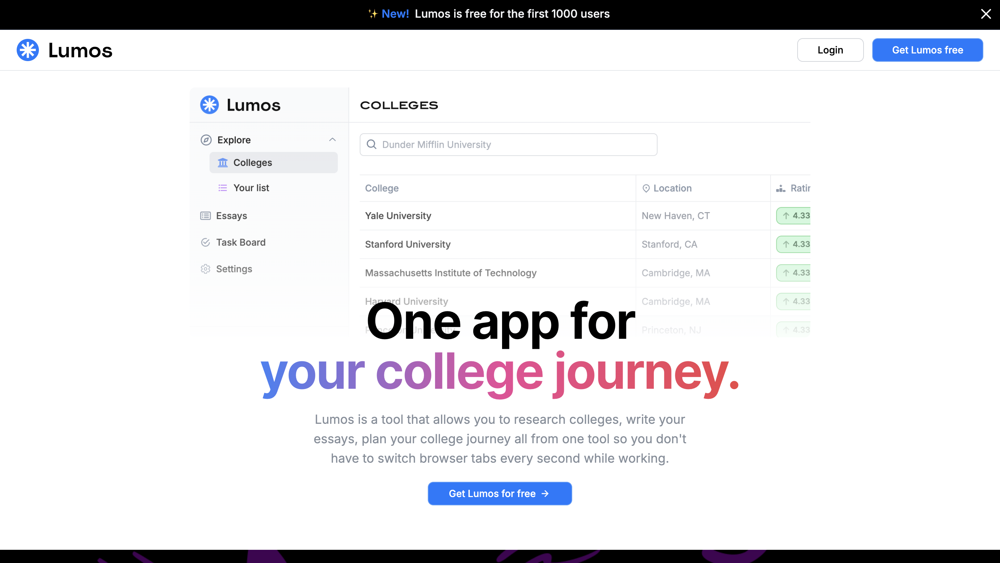
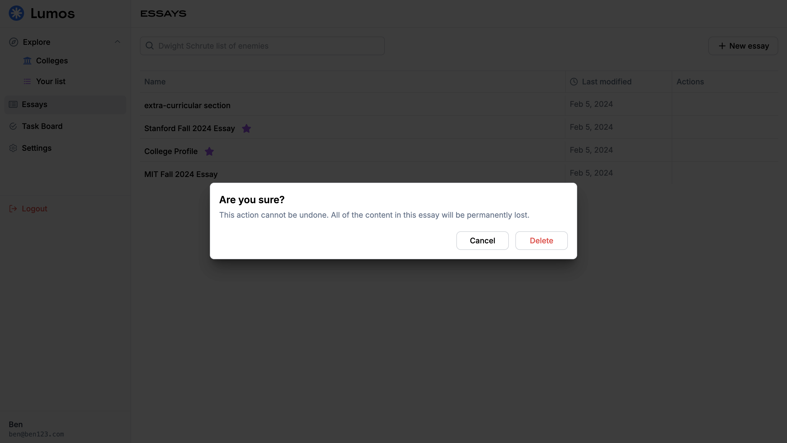
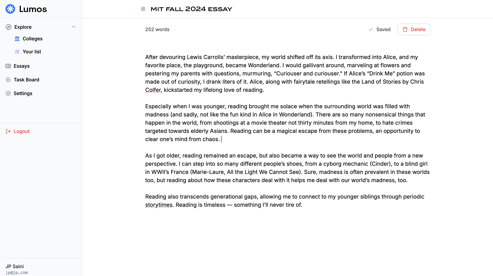
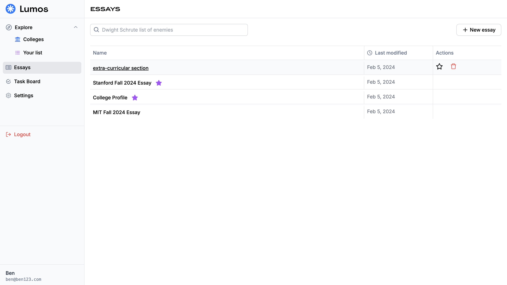
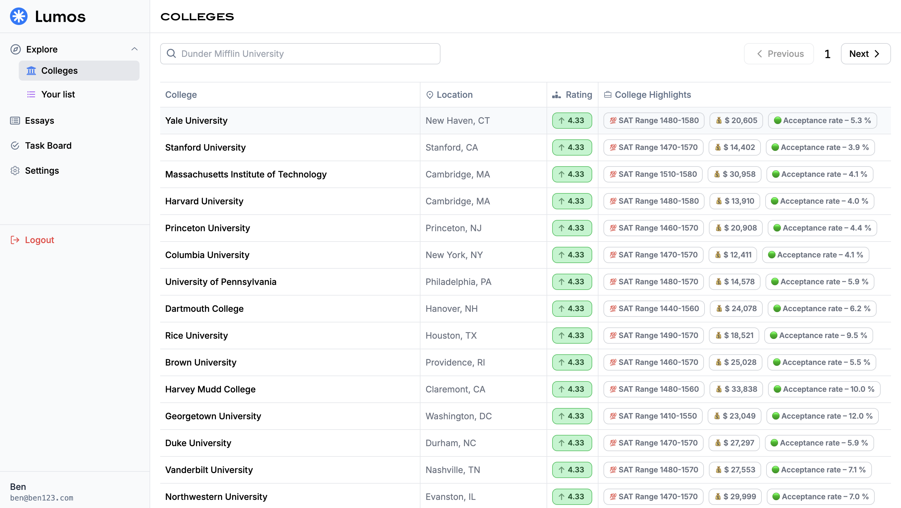
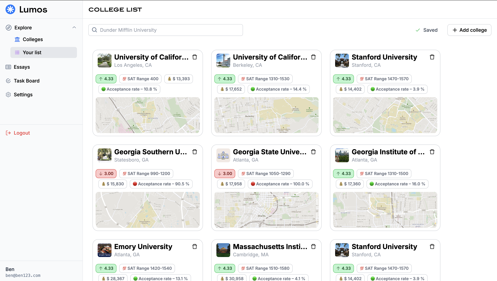
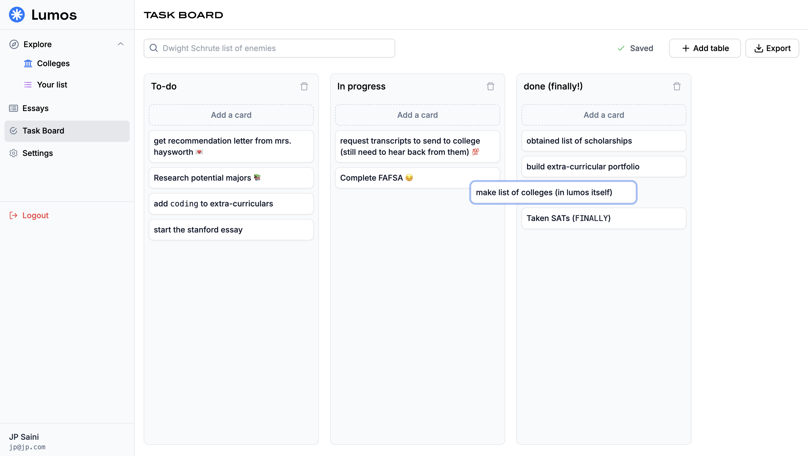

-   resources tab should contain info about financial aid, international student immigration stuff, mental health
-   AI help in writing your college essays
-   peer review for helping students with essays.
-   profile builder? (using AI, and the college list data, give tips)
-   job shadowing and internship oppurtunities

========

-   do the vscode 'organise imports' thingy
-   `http://11.36.253.243/`
    – TODO – add nice text and illustrations for the "no results found" component

=== feedback ====

-   add button to explore colleges and add them to your list from that page itself
-   better filtering options for colleges (search by ivy league, state schools, and location)
