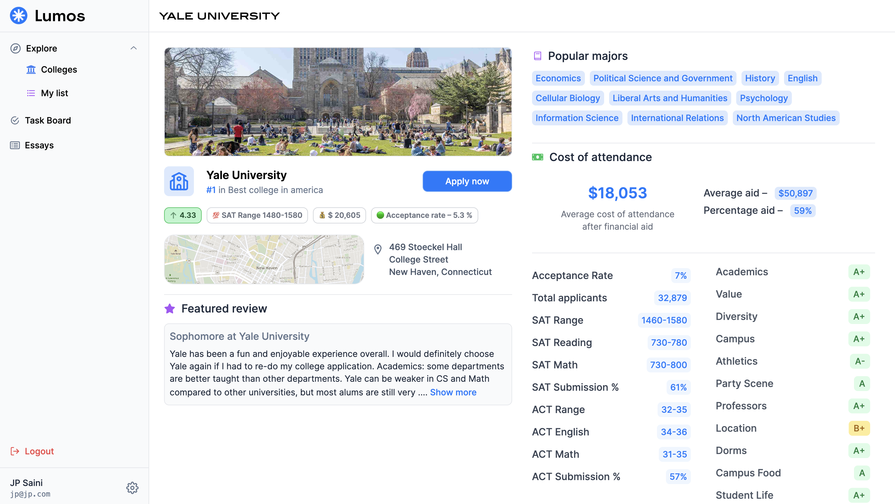
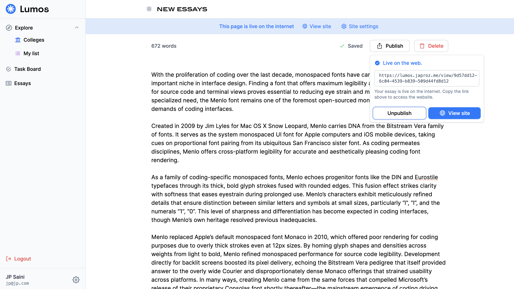
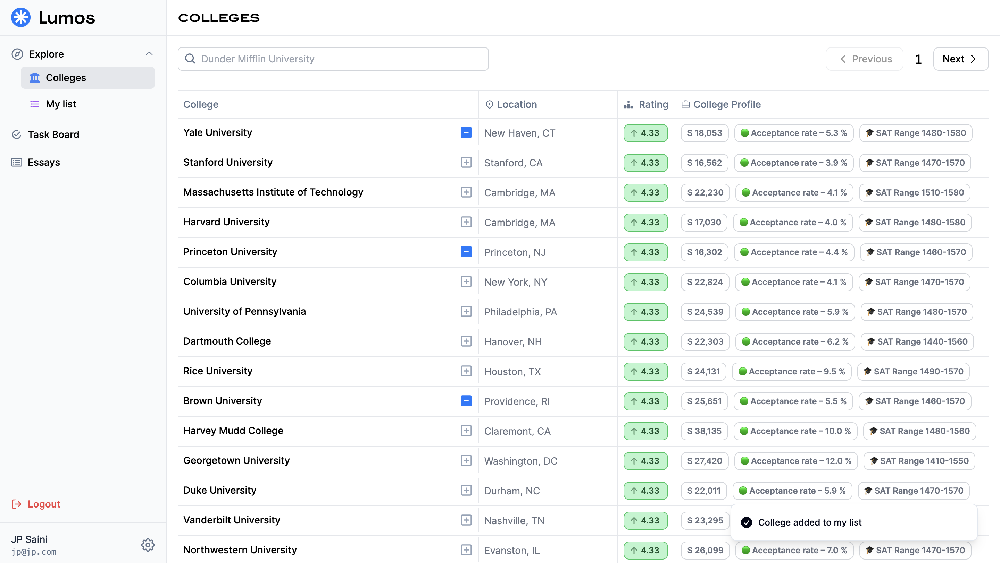

-   resources tab should contain info about financial aid, international student immigration stuff, mental health
-   AI help in writing your college essays
-   peer review for helping students with essays.
-   profile builder? (using AI, and the college list data, give tips)
-   job shadowing and internship oppurtunities

========

-   do the vscode 'organise imports' thingy
-   `http://11.36.253.243/`

=== feedback ====

-   ✅ add button to explore colleges and add them to your list from that page itself
-   add nice text and illustrations for the "no results found" component
-   better filtering options for colleges (search by ivy league, state schools, and location)
-   sort by rank, grades, by money advance
-   ❓ add numbers next to explore college page

-   ❓ add default columns to task board (dream, target, safety)
-   ✅❓ create a college page to show useful information and not trash things
-   🕰️ create college profile builder
-   ✅ add logout to the bottom of the sidebar
-   ✅ hide settings (add a popup on the sidebar profile section)
-   ✅ move logout to the bottom
-   link kanban board to your list
-   (future 🕰️) – use keys to move through add college modal search results
-   ✅ replace "college highlights" with something else
-   ✅ view data in "my list" as cards or as list
-   change college highlights acceptance rate fees (it shows fees after)
-   ✅ add a share functionality
-   saved searches
-   make a real settings page
-   add opengraph tags
-   Add scrollbar to task board to go left (PC's cant scroll left without scrollbar);
-   match the acceptance rate
-   Add cron job to backup postgres db in digital-ocean vm
-- link to scholarship https://phillips-scholarship.org/apply/determining-financial-eligibility/cost-of-college-list/
